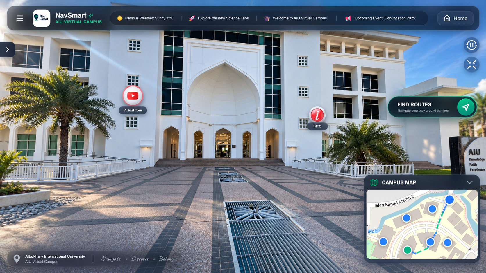
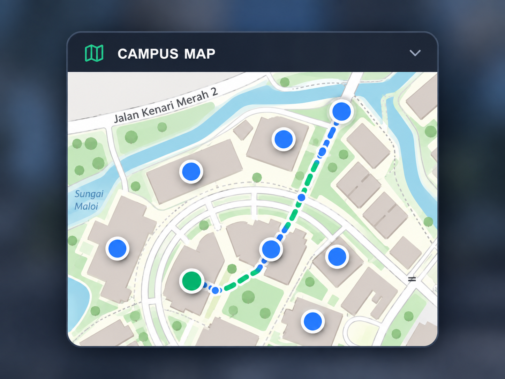
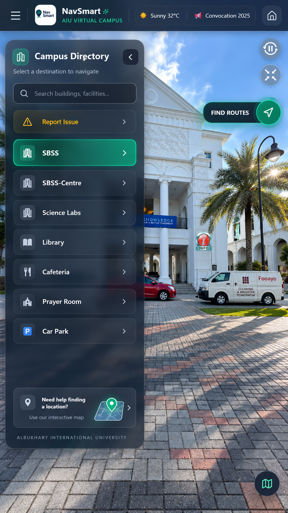
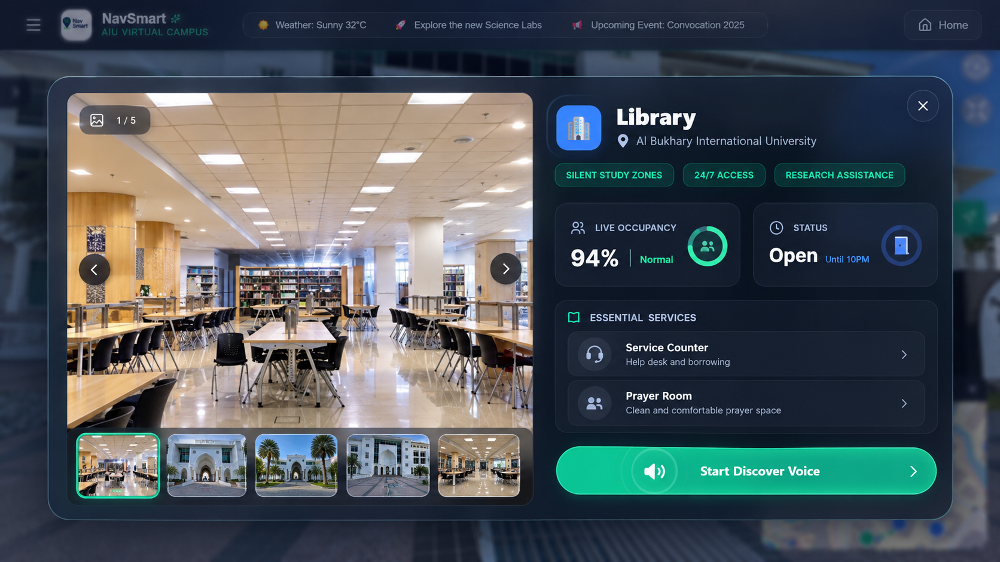
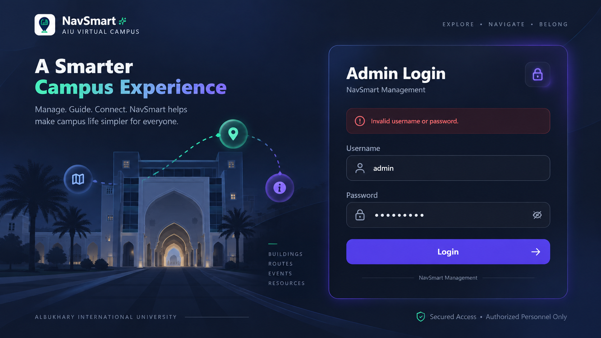
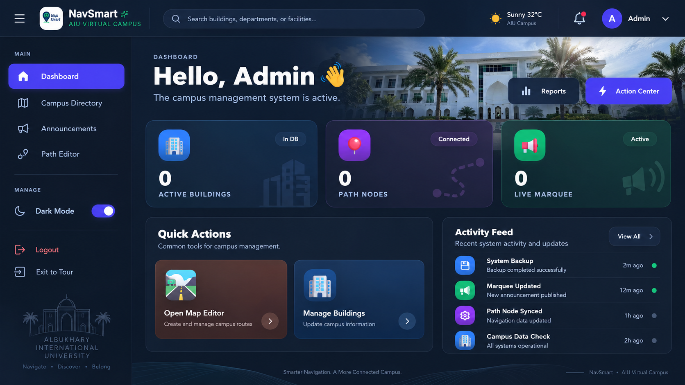
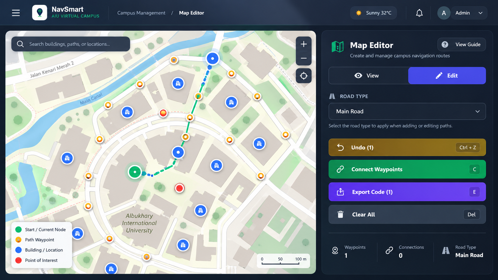
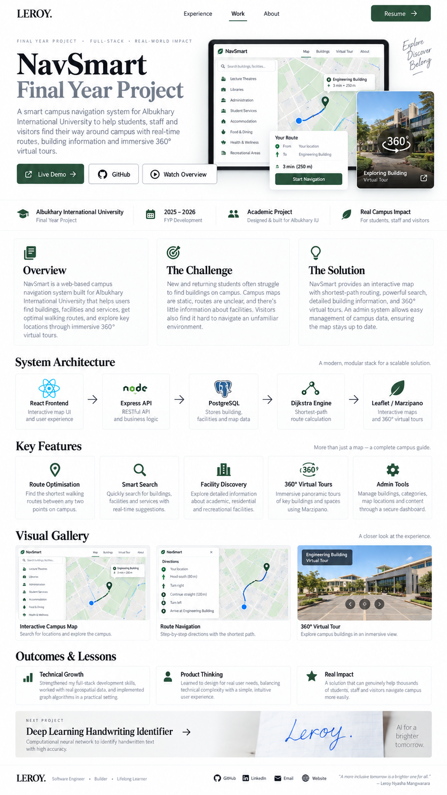

# NavSmart — AIU Smart Campus Experience Platform

**A smart-campus platform combining intelligent navigation, immersive 360° exploration, campus discovery, multilingual assistance, and administrative content management.**

[Live Demo](https://nav-smart.vercel.app/) · [GitHub Profile](https://github.com/Leroy-laboe) · [LinkedIn](https://www.linkedin.com/in/leroy-nyasha-mangwarara-86185a302/)

> **Source code is private.** This repository is a public product and engineering case study for NavSmart. It documents the experience, architecture, technical approach, validation, and selected interfaces without exposing the full implementation.

---



## Overview

NavSmart is a **Smart Campus Navigation & Experience Platform** developed as a Final Year Project at **Albukhary International University (AIU)**.

The project began with a campus-navigation problem, but evolved into a broader smart-campus experience that connects:

- intelligent route guidance;
- interactive campus mapping;
- 360° panoramic exploration;
- building and facility discovery;
- contextual information and media;
- multilingual assistance and voice narration;
- campus announcements;
- administrative tools for maintaining navigation and campus content.

Instead of functioning as a static campus map, NavSmart combines a navigable campus graph, interactive visual interfaces, immersive destination views, and maintainable campus data in one web-based system.

---

## The Problem

Large university campuses are difficult to navigate, especially for:

- new students;
- visitors;
- event attendees;
- staff unfamiliar with certain facilities;
- users who need more context than a traditional map or signboard provides.

Common navigation methods such as printed maps, signboards, and verbal directions can create unnecessary time loss, stress, and dependence on staff.

NavSmart was designed to improve the **entire campus orientation experience**, not only the final route from A to B.

---

## What NavSmart Does

### Intelligent Navigation

NavSmart calculates campus routes using a graph-based routing model and **Dijkstra's shortest-path algorithm**.

The system is designed so routes follow actual roads and walkable paths rather than cutting directly through buildings or non-walkable areas.


---

### Interactive Campus Map

The 2D campus map provides:

- zoom and pan interaction;
- building and location markers;
- road nodes and waypoints;
- destination search;
- route polyline visualisation;
- contextual location information.



---

### Campus Directory & Discovery

Users can browse and search campus facilities through a directory instead of needing to know the exact location beforehand.



The experience is intended to support both **navigation** and **campus discovery**.

---

### 360° Virtual Campus Exploration

NavSmart integrates panoramic campus experiences so users can visually explore selected AIU locations.

Real campus imagery was captured and used in panorama scenes, with hotspots supporting movement and location-based exploration.



This helps users recognise destinations before physically arriving there.

---

### Contextual Information & Multimedia

Locations can provide richer content beyond coordinates, including:

- building descriptions;
- location details;
- facility information;
- operating context;
- multimedia / video links;
- immersive visual content.

This turns NavSmart from a route viewer into a broader **digital campus orientation layer**.

---

### Multilingual & Voice-Assisted Experience

The frontend was designed with multilingual support through a translation service and voice narration using browser speech capabilities.

This improves accessibility for a more diverse campus audience and supports users who benefit from spoken guidance or translated information.

---

## Routing Engine

NavSmart models AIU as a weighted graph containing two primary node types:

- **building nodes** — destinations such as the Library or Canteen;
- **road nodes / waypoints** — intermediate points representing the walkable network.

Buildings connect to their nearest appropriate road node, while road nodes form the routing network.

```text
User selects Start + Destination
              │
              ▼
Map buildings to graph nodes
              │
              ▼
Connect each building to nearby road node
              │
              ▼
Compute edge weights
              │
              ▼
Run Dijkstra on road network
              │
              ▼
Return ordered coordinates
              │
              ▼
Render route polyline on map
```

Edge weights are based on geographic distance, allowing the route engine to compare possible paths and return an ordered route for visualisation.

---

## Smart Campus Management

NavSmart also includes an administration layer so campus information does not need to remain fixed in frontend code.

### Admin Portal



### Admin Dashboard



### Visual Map Editor



The management side supports maintaining areas such as:

- navigation nodes;
- path connections;
- building information;
- announcements;
- location content.

This makes NavSmart closer to a maintainable **campus digital platform** than a one-off map prototype.

---

## System Architecture

```text
┌───────────────────────────────────┐
│          React + Vite SPA         │
│                                   │
│ Directory / Search / Map / 360°   │
│ Routing UI / Voice / Admin UI     │
└─────────────────┬─────────────────┘
                  │ HTTP / REST
                  ▼
┌───────────────────────────────────┐
│        Node.js + Express API      │
│                                   │
│ Auth / Search / Campus Content    │
│ Route Computation / Admin CRUD    │
└─────────────────┬─────────────────┘
                  │
          ┌───────┴────────┐
          ▼                ▼
┌──────────────────┐  ┌────────────────────┐
│    PostgreSQL    │  │ Navigation Engine  │
│                  │  │                    │
│ Buildings        │  │ Weighted graph     │
│ Nodes            │  │ Dijkstra routing   │
│ Paths            │  │ Direction control  │
│ Media            │  └────────────────────┘
│ Admin data       │
└──────────────────┘

External / browser services:
• map tiles / map services
• multimedia links
• translation service
• Web Speech narration
```

---

## Frontend Architecture

The frontend is structured as a single-page application built around modular UI and shared state.

### Key frontend technologies

| Area | Technology |
| --- | --- |
| Application | React + Vite |
| Mapping | React Leaflet / Leaflet |
| 360° Experience | Marzipano |
| State Management | Zustand |
| Styling | Tailwind CSS |
| Motion | Framer Motion |
| Translation | MyMemory API |
| Voice Narration | Web Speech API |

---

## Backend Capabilities

The backend provides the application layer between the React frontend and PostgreSQL.

Core responsibilities include:

- JWT-based authentication;
- bcrypt password hashing;
- route computation;
- navigation-node APIs;
- case-insensitive location search;
- public campus-data endpoints;
- admin CRUD workflows;
- content updates without requiring a frontend redeployment.

---

## Real-World Validation

NavSmart was not evaluated only in a classroom environment.

The project was tested with real users during the **STI Madani event**, where approximately **1,000 visitors** were exposed to the system.

### User-testing snapshot

| Validation Metric | Result |
| --- | ---: |
| Event visitors | **1,000+** |
| Survey responses | **163** |
| Evaluation focus | Ease of use, usefulness, satisfaction |
| Survey language | Bahasa |

This provided direct feedback on the usability and adoption potential of the platform.

---

## Key Project Achievements

### Full-Stack Integration

The product connects a React frontend, Express backend, PostgreSQL database, routing logic, and immersive media experience.

### Advanced Navigation

The project combines Dijkstra-based shortest-path routing with real-time route visualisation and map interaction.

### 2D + 360° Experience

Map navigation is connected with immersive destination exploration instead of treating the map and virtual tour as isolated products.

### Rich Discovery

NavSmart includes searchable locations, contextual building information, multimedia, multilingual support, and voice narration.

### Real-User Validation

The project was demonstrated and tested with a large live audience rather than being evaluated only through developer testing.

---

## Tech Stack

| Area | Technologies |
| --- | --- |
| **Frontend** | React, Vite, JavaScript |
| **Mapping** | Leaflet, React Leaflet |
| **360° Experience** | Marzipano |
| **State Management** | Zustand |
| **Styling / Motion** | Tailwind CSS, Framer Motion |
| **Translation / Voice** | MyMemory API, Web Speech API |
| **Backend** | Node.js, Express |
| **Database** | PostgreSQL |
| **Authentication** | JWT, bcrypt |
| **Routing** | Dijkstra's shortest-path algorithm |
| **Version Control** | Git, GitHub |
| **Deployment** | Vercel + backend deployment infrastructure |

---

## My Role

**Final Year Project — Group 42**

NavSmart was developed as a team project.

My documented responsibilities focused primarily on the **frontend experience and immersive campus layer**.

### Leroy Nyasha Mangwarara — Frontend Developer

I was responsible for:

- implementing core UI components in React;
- building navigation-facing frontend features;
- integrating the **Marzipano 360° panorama engine**;
- enabling interactive indoor / location views;
- supporting seamless scene navigation;
- contributing to the overall user experience and frontend integration.

The wider project was completed collaboratively, with backend architecture, database management, API integration, additional frontend work, testing, and documentation distributed across the team.

---

## Development Approach

The project followed an **incremental development model** so functional components could be introduced, validated, and refined progressively.

The major increments covered:

1. system setup and architecture;
2. building and location data management;
3. navigation and search;
4. 360° tours and multimedia integration.

This made it possible to test core functionality early and incorporate feedback as the product evolved.

---

## Selected UI Showcase

> **Presentation note:** the visuals below are polished presentation versions based directly on real NavSmart screens. UI styling, spacing, typography, and framing were refined for this case study. They do not represent additional functionality that is absent from the project.



| Product Area | Preview |
| --- | --- |
| Smart Campus Experience |  |
| Campus Map & Routing |  |
| Admin Dashboard |  |
| Campus Directory |  |
| Visual Map Editor |  |
| Immersive Location Explorer |  |

---

## Smart Campus Impact

NavSmart was designed to support a broader smart-campus strategy by:

- reducing navigation time and user stress;
- improving the first-time campus experience;
- reducing dependence on staff for manual directions;
- providing visual and immersive orientation;
- supporting maintainable digital campus information;
- improving accessibility for a diverse user base.

The project primarily contributes to **Smart Technology & Data**, while also supporting outcomes related to smart society, governance, and sustainable campus development.

---

## Commercial & Expansion Potential

Although developed for AIU, the underlying platform concept can be adapted for other complex environments.

Potential deployment contexts include:

- universities;
- hospitals;
- corporate campuses;
- resorts;
- exhibition centres;
- large public facilities.

Possible future product directions include:

- institution subscription models;
- configurable multi-campus deployments;
- premium campus modules;
- indoor navigation;
- accessibility-aware routing;
- offline navigation;
- AI-assisted route optimisation;
- real-time crowd or route data.

For that reason, the implementation repository is being kept private while I continue exploring the project's future direction.

---

## Current Limitations

The current project has known boundaries:

- navigation is primarily focused on outdoor campus movement;
- an internet connection is required for real-time map functionality;
- full indoor navigation is not yet implemented;
- real-time crowd / traffic data is not currently available.

These limitations form part of the future-development roadmap rather than being hidden from the case study.

---

## Live Demo

### [Open NavSmart →](https://nav-smart.vercel.app/)

---

## Contact

**Leroy Nyasha Mangwarara**

Computer Science · Frontend Engineering · Full-Stack Systems · Applied AI / Data

[LinkedIn](https://www.linkedin.com/in/leroy-nyasha-mangwarara-86185a302/) · [GitHub](https://github.com/Leroy-laboe) · [Email](mailto:mangwararaleroy@gmail.com)
