# NavSmart Campus: Smart Campus Navigation System

**NavSmart Campus** is an immersive web-based navigation platform designed for Albukhary International University (AIU). It bridges the gap between traditional 2D mapping and real-world exploration by integrating Augmented Reality (AR) concepts, 360° virtual tours, and intelligent shortest-path routing.

## 🌟 Key Features

### 🗺️ Intelligent Navigation
- **Shortest Path Routing**: Powered by Dijkstra's algorithm, the system calculates the most efficient walking paths between any two points on campus.
- **Interactive 2D Map**: A custom-styled Leaflet map with interactive pins for all major buildings and points of interest.
- **Dynamic Search**: Quickly locate facilities, lecture halls, and offices with real-time search suggestions.

### 🎥 Immersive Virtual Tours
- **360° Exploration**: High-resolution panoramic views powered by the Marzipano engine, allowing users to "walk" through the campus virtually.
- **Contextual Hotspots**:
    - **Info Hotspots**: Detailed building history and operating hours with a built-in voice guide.
    - **Video Hotspots**: Embedded YouTube presentations for facility walkthroughs.
    - **Link Hotspots**: Seamless transitions between different campus scenes.

### 🛡️ Admin Command Center
- **Real-time Announcements**: Broadcast critical campus updates (e.g., event changes, library hours) to the public marquee.
- **Content Management**: Update building metadata, manage path nodes, and monitor system health through a secure dashboard.

## 🛠️ Technology Stack

| Component | technologies |
| :--- | :--- |
| **Frontend** | React 19, Vite, Tailwind CSS, Zustand |
| **Mapping & VR** | Leaflet.js, Marzipano Engine |
| **Backend** | Node.js, Express |
| **Database** | PostgreSQL |
| **Security** | JWT (JSON Web Tokens), bcrypt hashing |
| **Algorithms** | Dijkstra's Shortest Path Algorithm |

## 📐 System Architecture

NavSmart Campus utilizes a **Hybrid Data Strategy** for optimal performance:
1. **Static Bootstrapping**: A local graph network ensures the map and navigation logic load instantly.
2. **Dynamic Hydration**: Background API calls fetch real-time announcements and occupancy status, merging them into the active session.

## 🌍 Sustainable Development Goals (SDGs)

This project is aligned with the following UN Sustainable Development Goals:
- **SDG 4: Quality Education**: Enhancing campus accessibility for all students and visitors.
- **SDG 9: Industry, Innovation, and Infrastructure**: Implementing cutting-edge AR and web technologies.
- **SDG 11: Sustainable Cities and Communities**: Reducing paper waste from physical maps and optimizing campus movement.

## Demo
🌐 Live preview : [Visit](https://nav-smart.vercel.app/)

## Screenshots

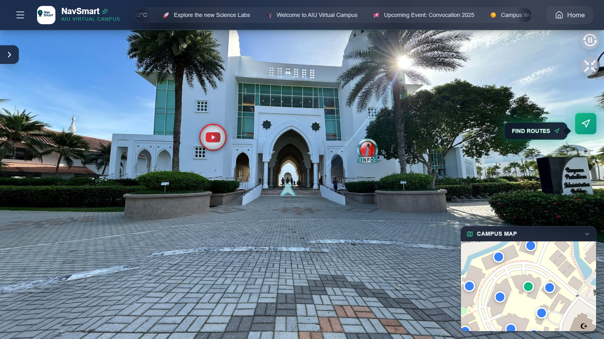

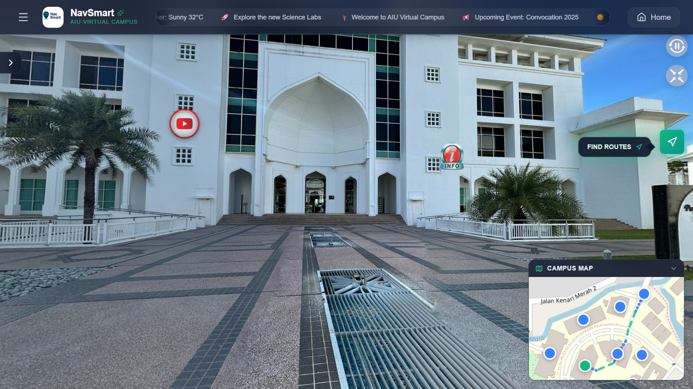

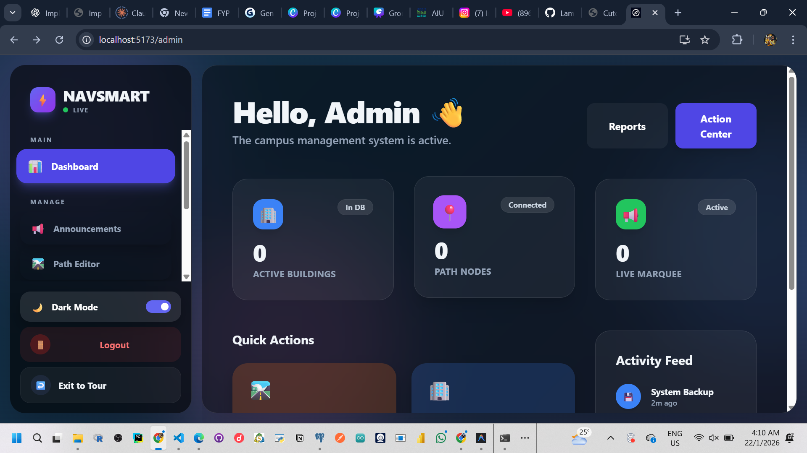
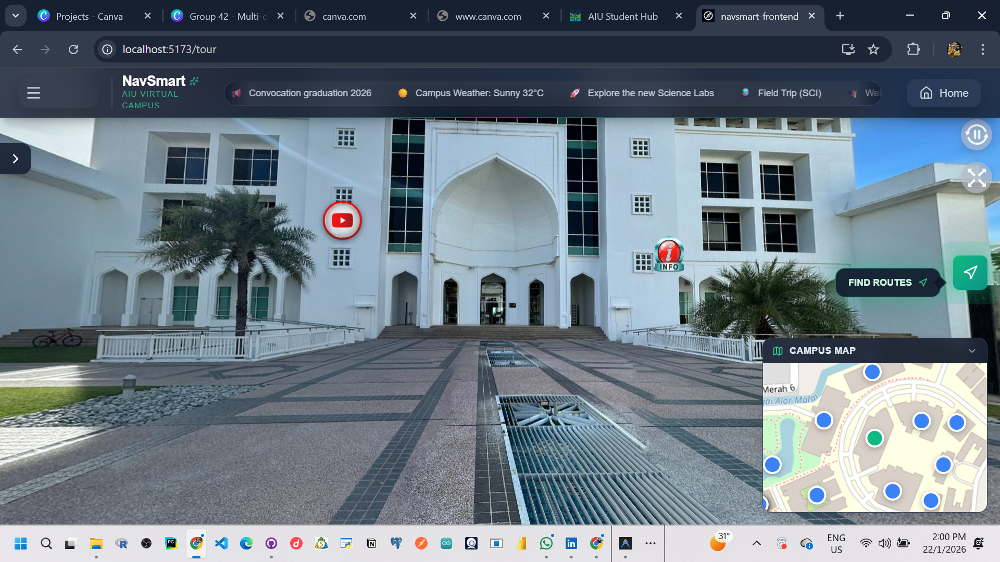
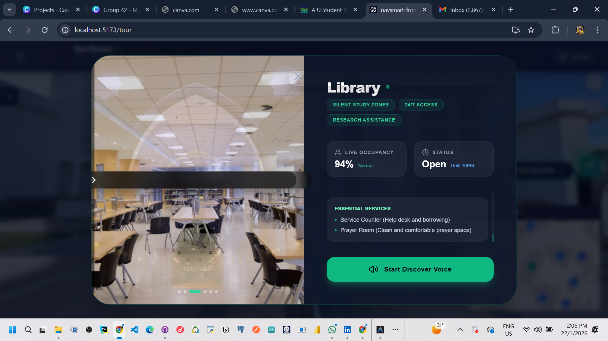
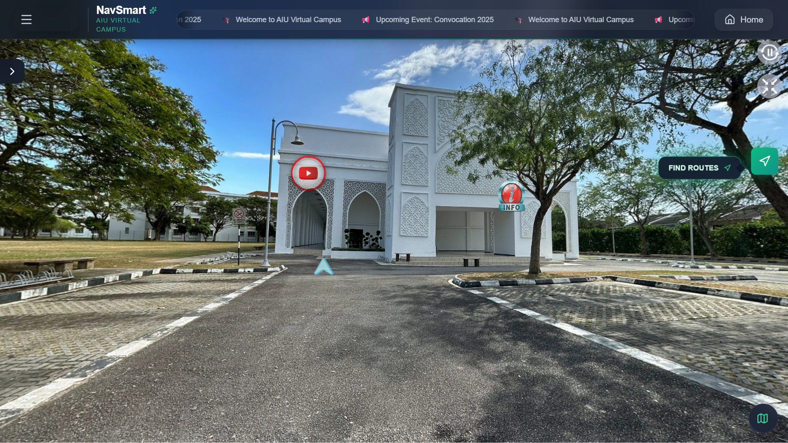
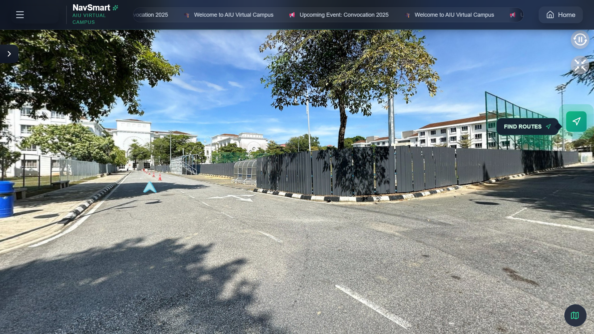
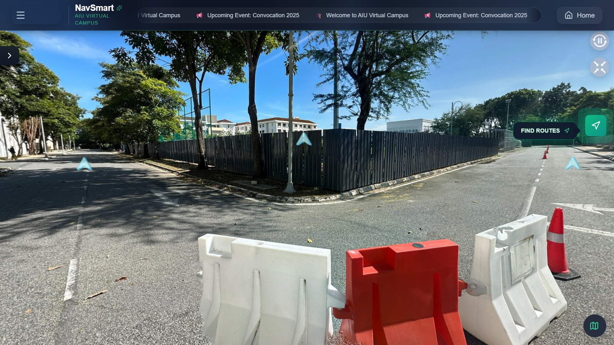
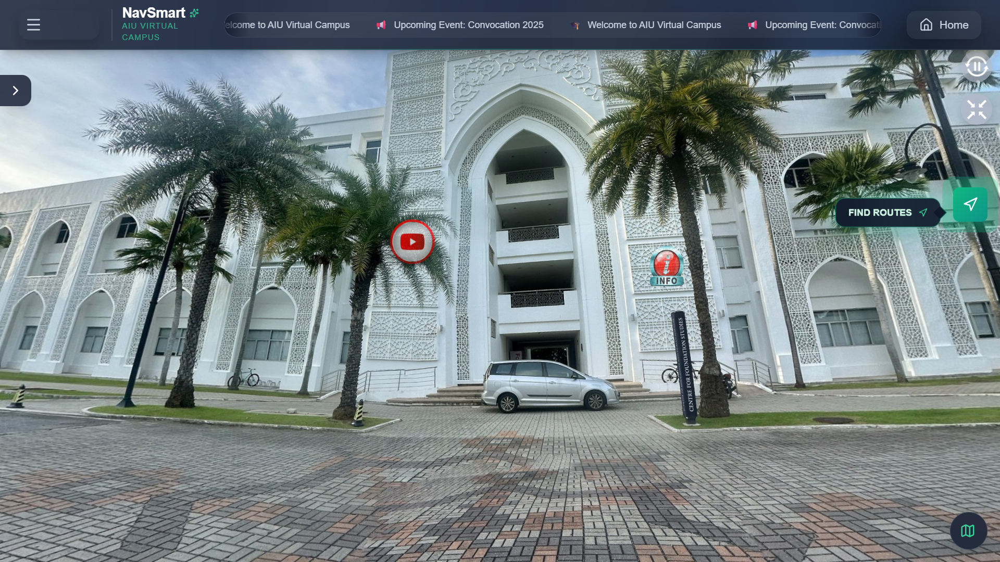
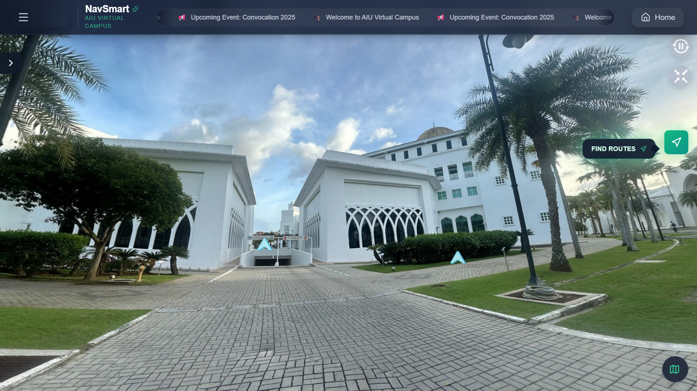
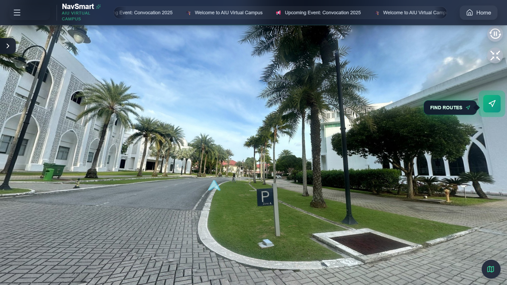
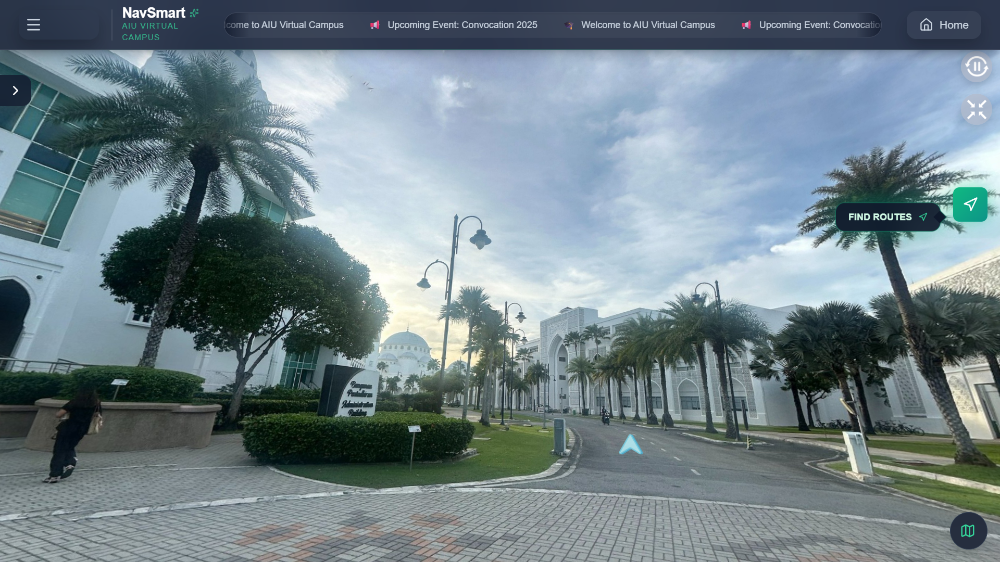
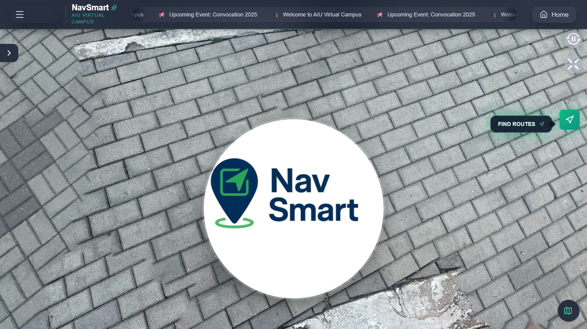
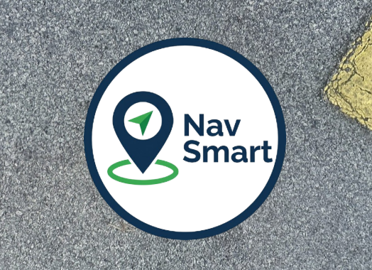
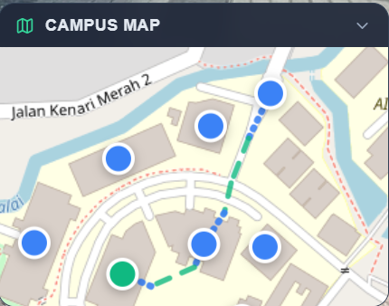
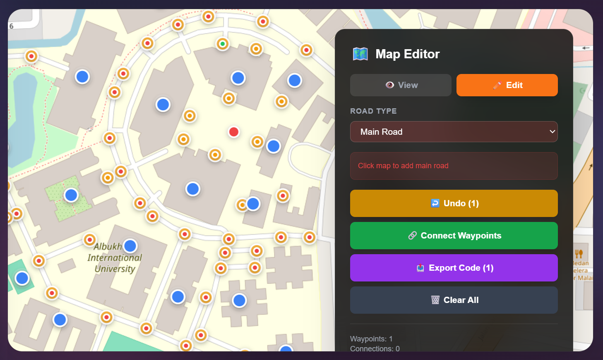
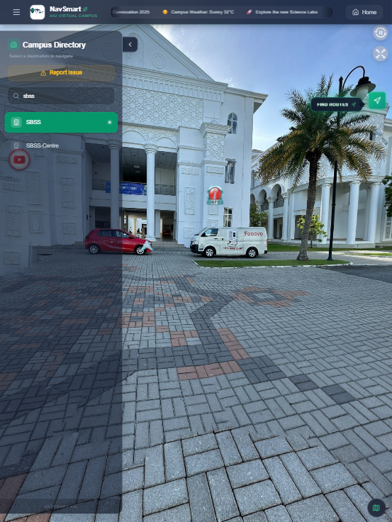
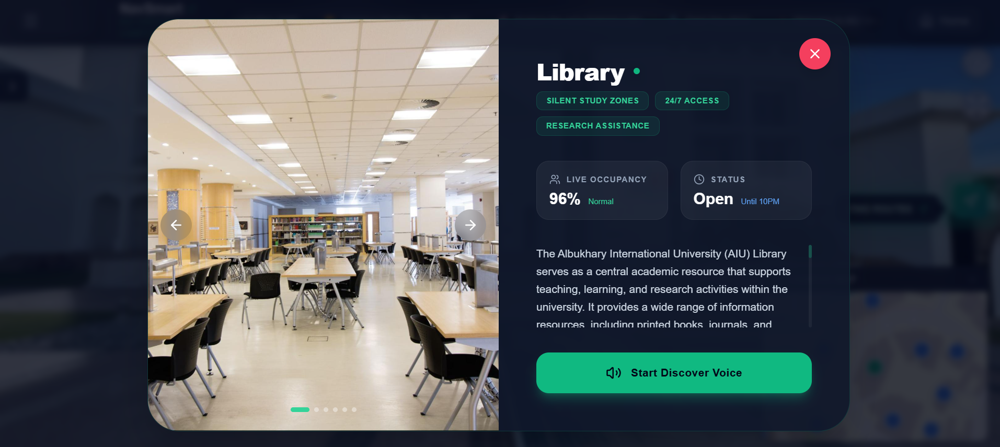
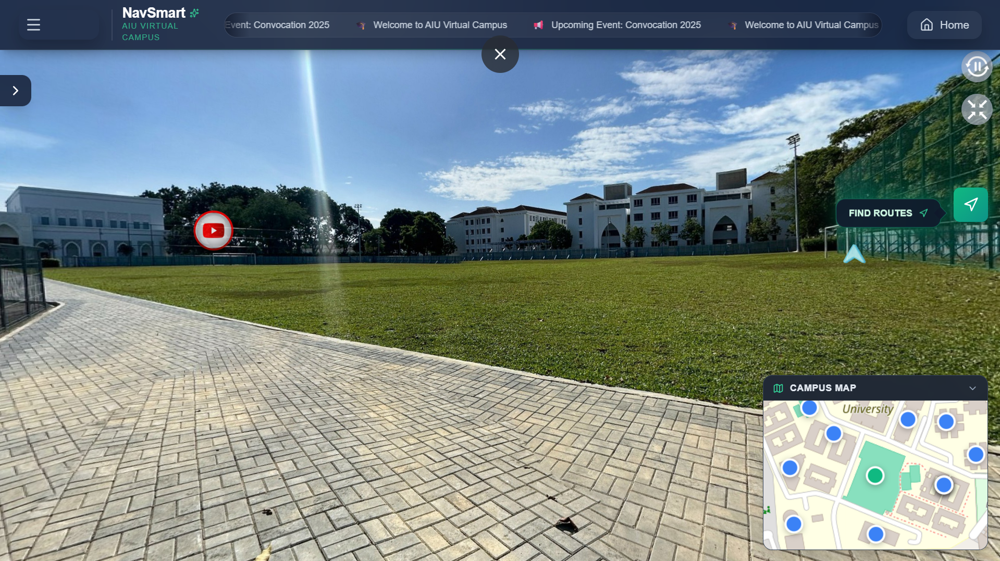

## Contact
If you'd like a private walkthrough for internship evaluation:
📩 mangwararaleroy@gmail.com
